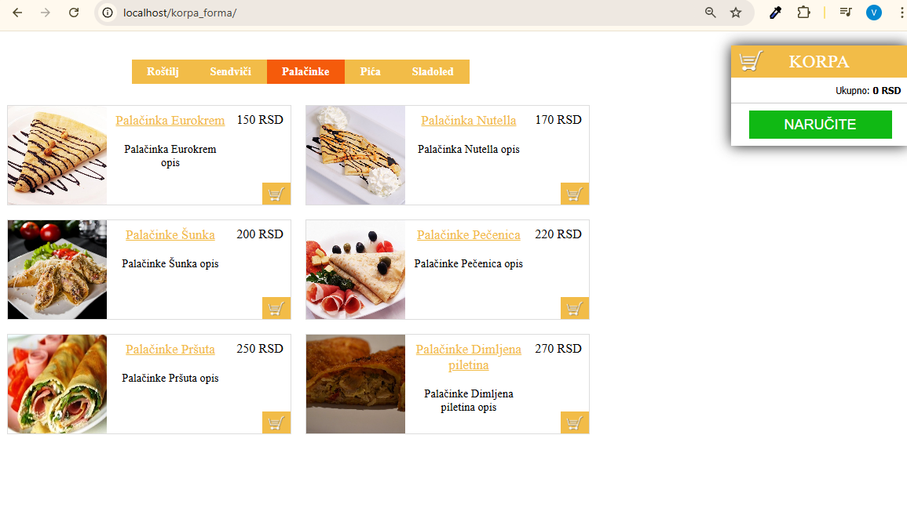
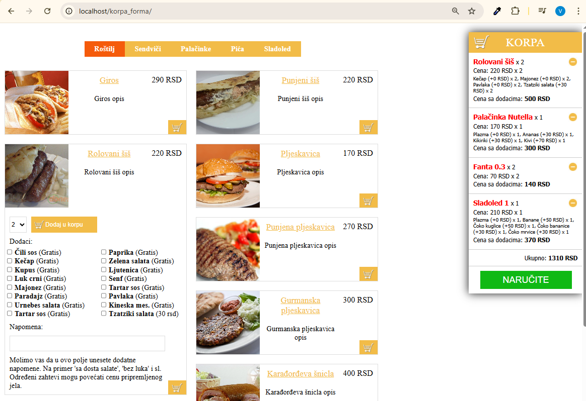
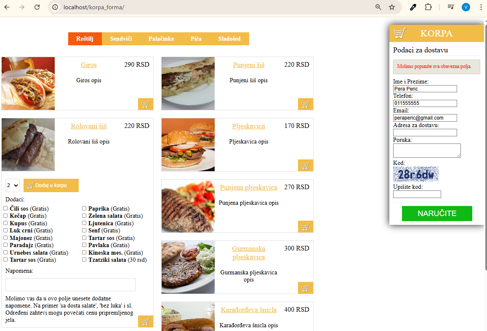
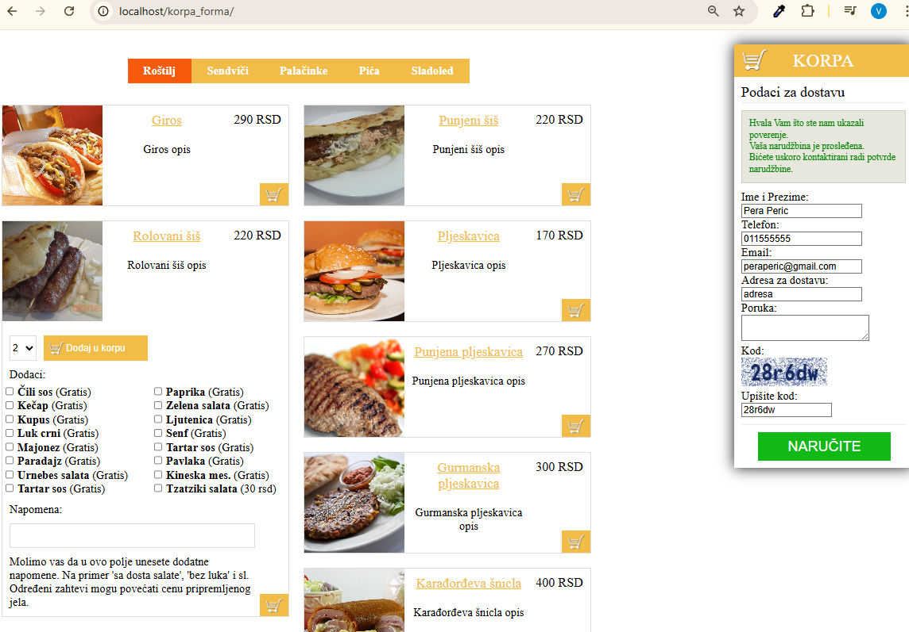

# Korpa i Forma - Mini Web Shop (2015) / Cart & Form - Mini Web Shop (2015)

## 🇬🇧 English

This is a personal mini web project created in 2015 simulating an online food ordering system.  
It demonstrates working with a PHP backend and jQuery frontend for cart, products, and add-ons.

### Features
- Product display by categories
- Add products to cart
- Dynamic add-ons and optional notes for products
- Sending orders via `send_order.php`
- Sessionless Captcha bot protection

### Technologies
- PHP 5.x
- jQuery 1.7.1
- HTML5 + CSS3
- Sessionless Captcha library

### Project structure
korpa_forma/
├─ index.php
├─ send_order.php
├─ layouts/ # PHP template files for products and add-ons
├─ js/ # JavaScript files, e.g., cart.js
├─ css/ # CSS styles
├─ sessionless_captcha/ # Captcha library
├─ products/ # Product images
├─ LICENSE
└─ README.md

### Installation
1. Download all project files.  
2. Upload the files to a PHP server (e.g., XAMPP, LAMP, or any PHP-supported hosting).  
3. Make sure the PHP `mail()` function is correctly configured to send emails.  
4. Open `index.php` in your browser.

### License
This project is licensed under the **MIT License**. You are free to use, modify, and distribute it, provided that you include the original license and copyright notice.

### Notes
- This project was developed 10+ years ago as a personal demo without modern frameworks.  
- Today, a modern stack like Laravel/Vue would probably be used, but this is a legacy example from 2015.

### Project Images

## 🇷🇸 Srpski

Ovo je lični mini web projekat razvijen 2015. godine koji simulira online narudžbinu hrane.  
Služi kao demonstracija rada sa PHP backend-om i jQuery frontend-om za korpu, proizvode i dodatke.

### Funkcionalnosti
- Prikaz proizvoda po kategorijama
- Dodavanje proizvoda u korpu
- Dinamički dodaci i opcionalni napomene za proizvode
- Slanje narudžbina preko `send_order.php`
- Sessionless Captcha zaštita od botova

### Tehnologije
- PHP 5.x
- jQuery 1.7.1
- HTML5 + CSS3
- Sessionless Captcha library

### Struktura projekta
korpa_forma/
├─ index.php
├─ send_order.php
├─ layouts/ # PHP template fajlovi za proizvode i dodatke
├─ js/ # JavaScript fajlovi, npr. cart.js
├─ css/ # CSS stilovi
├─ sessionless_captcha/ # Captcha biblioteka
├─ products/ # Slike proizvoda
├─ LICENSE
└─ README.md

### Instalacija
1. Preuzmite sve fajlove projekta.  
2. Postavite fajlove na PHP server (npr. XAMPP, LAMP, ili hosting koji podržava PHP).  
3. Uverite se da je PHP `mail()` funkcija ispravno podešena za slanje email-ova.  
4. Otvorite `index.php` u pregledaču.

### Licenca
Ovaj projekat je dostupan pod **MIT licencom**. To znači da ga možete slobodno koristiti, menjati i distribuirati, pod uslovom da zadržite originalnu licencu i obaveštenje o autorskim pravima.

### Napomene
- Projekat je razvijen pre 10+ godina kao lični demo, bez korišćenja modernih framework-a.  
- Danas bi se verovatno koristio Laravel/Vue ili drugi moderni stack, ali ovo je legacy primer iz 2015.

### Slike Projekta

